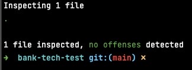
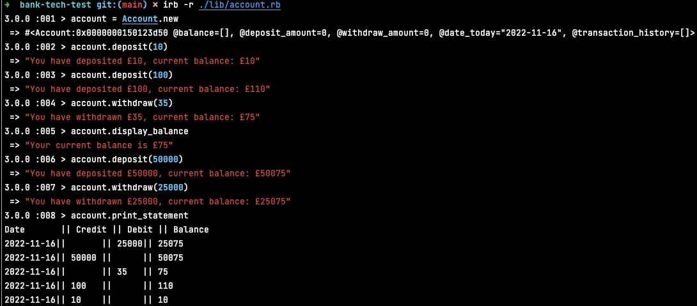
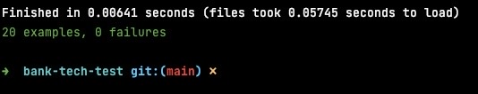
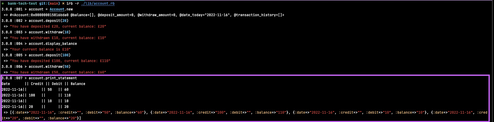

# Bank Tech Test

## Technologies and Design Principles:   
This project was built using Ruby. 
- To ensure readable and clean code, the SOLID principles were used throughout. 
- TDD approach.
- Testing technology is RSpec. 
- Rubocop implemented with no offences </br>


### To run this on your machine
```shell
git clone https://github.com/saritahub/bank-tech-test.git
bundle install
```

## To open the banking program 
**_Suggested walk-through:_** 

1. Open your terminal and run: 
```shell
irb -r ./lib/account.rb
```
2. From here, you can create a new account:
```shell
account = Account.new
```

3. Then, confirm that the starting balance is £0:  
```shell
account.display_balance
```
  
4. Then, you can make a deposit. For example:  
```shell
account.deposit(100)
```

5. Then, you can make a withdrawal: 
```shell
account.withdrawal(25)
```

6. Then, you can print the statement: 
```shell
account.print_statement
```



### Other tests you can run: 
1. Attempt to withdraw when the balance is £0:
```shell
account = Account.new 
account.withdraw(10)
```

2. Attempt to withdraw an amount that is higher than the current balance: 
```shell
account = Account.new
account.deposit(500)
account.withdraw(600)
```

3. Add a non-numerical (i.e not an Integer) value to the deposit or withdrawal amount:
```shell
account = Account.new
account.deposit("500")
```

### Full list of methods you can use

| Method name     | Description                                                  |
|-----------------|--------------------------------------------------------------|
| deposit         | Deposit any amount above 0                                   |
| withdraw        | Withdraw any amount between 0 and the current balance        |
| display_balance | Displays the current balance in GBP (£)                      |
| print_statement | Prints all of the current transactions in reverse date order | 

## Testing
### To run the tests
- All tests are green. 
- **Note:** the tests are using 'Date.now', so will always reflect today's date.
- Ensure you are in the main 'bank-tech-test' folder.
- Open your terminal and run: 
```shell
rspec
```

### Testing notes
- Rubocop is set to ignore the spec file 


# Project goals

## Task
- This is a command line app, where the user can make a deposit, withdrawal and view their bank statement. 

### Requirements

* You should be able to interact with your code via a REPL like IRB or Node.  (You don't need to implement a command line interface that takes input from STDIN.)
* Deposits, withdrawal.
* Account statement (date, amount, balance) printing.
* Data can be kept in memory (it doesn't need to be stored to a database or anything).

### Acceptance criteria

**Given** a client makes a deposit of 1000 on 10-01-2023  
**And** a deposit of 2000 on 13-01-2023  
**And** a withdrawal of 500 on 14-01-2023  
**When** she prints her bank statement  
**Then** she would see

```
date || credit || debit || balance
14/01/2023 || || 500.00 || 2500.00
13/01/2023 || 2000.00 || || 3000.00
10/01/2023 || 1000.00 || || 1000.00
```

## User stories
- [x] 1<br />
As a bank,<br />
As we don't want to give away money,<br />
Each user's account should start with a balance of zero

### Deposit 
- [x] 2<br />
As a user,<br />
So that I can store my money in the bank, <br />
I’d like to be able to make a deposit (credit)

- [x] 3<br />
  As a user,<br />
  So that I can keep track of how much money I deposit, <br />
  I want my statements to display the deposit amount

### Withdrawal
- [x] 4<br />
As a user,<br />
So that I can withdraw money from the bank, <br />
I’d like to be able to make a withdrawal (debit) 

- [x] 5 <br />
As a user, <br />
So I don't go into debt, <br />
I only want the withdrawal to take place if I have sufficient funds

- [x] 6 <br />
  As a user, <br />
  So I can keep on track of how much money I withdraw, <br />
  I want my statements to display the withdrawal amount

### Balance
- [x] 7<br />
As a user,<br />
So that I know how much money I have,<br />
I’d like to be able to view my balance 

- [x] 8<br />
  As a user,<br />
  So that I can keep track of my transactions,<br />
  I’d like to be able to view transaction dates

- [x] 9<br />
  As a user,<br />
  So that I can keep track of my account balance,<br />
  I’d like to be able to view my balance after making a withdrawals and deposits

### Print statement* [see below](Known-bug:-print_statement method)
- [ ] 10<br />
As a user,<br />
So that I can keep track of my deposits, withdrawals and balance,<br />
I’d like to be able to prints my bank statement with the transaction dates (recent date displayed first)

## Class design 
The class design recipe for Account can be found [**here.**](https://github.com/saritahub/bank-tech-test/blob/main/recipe/class_design_recipe.md)
- This describes the process of designing the class, with the initial unit test set-up.

## Approach 
This program was set up to mimic the actions of a bank account. Users can run the application locally on their terminal. 

The app consists of one Class, Account. Users can create an account, make deposits and withdrawals and print their statement. 

Initially, I planned to create multiple classes to distribute the responsibilities. However, I ran out of time and did not implement this.

### Known bug: print_statement method 
- The print_statement method successfully prints out the list of transactions (date, credit, debit and balance) in reverse date order.
- However, it also prints out the array of hashes (which the table is constructed from). Due to time constraints I was unable to fix this bug.
- This also means when the RSpec tests are run, the table is printed.
